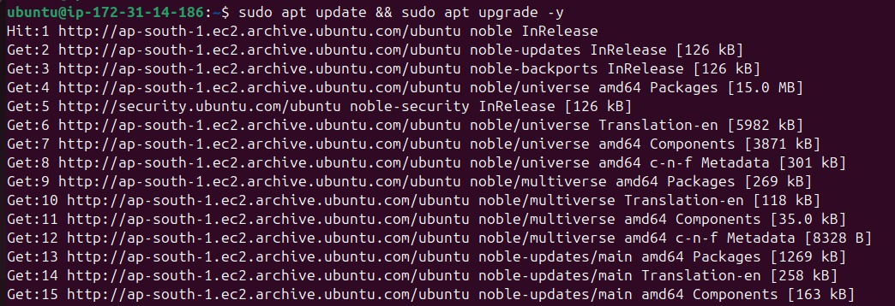

# Shared-Library Documentation

## Table of Contents

- [Introduction](#introduction)
- [Why Shared-Library?](#why-Shared-Library)
- [What is Shared-Library?](#what-is-Shared-Library)
- [Advantage of shared library](#Advantage-of-shared-library)
- [Disadvantage of shared library](#Disadvantage-of-shared-library)
- [workflow](#workflow)
- [Best Practices](#Best-Practices)
- [Conclusion](#conclusion)
- [Contact information](#Contact-information)
- [References](#references)

---

## Introduction

This documentation explains Shared Library in Jenkins with a clear, step-by-step approach. It helps you understand the structure, setup, and usage to streamline and reuse pipeline code effectively.

---

## Why Shared-Library?

- To standardize pipeline code across teams/projects.

- To avoid repetition of Groovy logic in multiple Jenkinsfiles.

- To encapsulate complex logic (e.g., deployment, testing, notifications).

- To version and test pipeline logic independently from application code.

---

## What is Shared-Library?

Shared library is a way to reuse code across multiple pipelines. It allows you to store commonly used functions, scripts, and resources in a separate repository and load them into your pipelines. This promotes code organization, reduces duplication, and simplifies pipeline maintenance. 

---

## Advantage of shared library

- **Code Reusability:**
Shared libraries allow you to define reusable functions, classes, and pipeline steps in a centralized location, eliminating the need to duplicate code across multiple pipelines. 

- **Standardization:**
By providing a common set of functions and steps, shared libraries help standardize pipeline definitions and processes across different projects, reducing inconsistencies and potential errors. 

- **Reduced Duplication:**
Shared libraries minimize code duplication, making pipelines easier to maintain and update. Changes to shared logic need only be applied in one place.

- **Improved Maintainability:**
Centralizing common functionalities in a shared library makes it easier to update, debug, and maintain pipeline logic, as changes are applied in one place and reflected across all pipelines using the library.

- **Faster Onboarding:**
Shared libraries can accelerate the onboarding of new applications, projects, or teams by providing a readily available set of reusable pipeline components. 

- **Versioning and Updates:**
Shared libraries can be versioned, allowing you to manage changes and updates to pipeline logic effectively, while maintaining access to previous versions. 

- **Extensibility:**
Shared libraries can be extended with custom Groovy functions and classes, allowing for complex logic and integrations. 

---

## Disadvantage of shared library

- **Learning Curve:** Requires understanding of Groovy and pipeline internals.

- **Debugging:** Errors may be harder to trace across multiple files.

---

## workflow

### Step 1: 
- Create a Git repository  for your Shared Library.
   
### Step 2: 
- Define folder structure

  
### Step 3: 
- in jenkins There are several places where Shared Libraries can be defined, depending on the use-case. Navigate to Manage Jenkins » System » Global Trusted Pipeline Libraries to configure as many libraries as necessary.

---

## Conclusion

Shared libraries in Jenkins Pipelines are a powerful tool for enhancing the modularity, reusability, and maintainability of your CI/CD processes. By centralizing common functionality in shared libraries, you can streamline your pipeline scripts, promote collaboration, and ensure consistency across projects. Start creating and using shared libraries in your Jenkins Pipelines to unlock their full potential and simplify your automation workflows.

---

## Author

- **Name:** Sunny Kumar
- **Email:** sunny.kumar.snaatak@mygurukulam.co

---

## References

- [shared library Official Documentation](https://www.jenkins.io/doc/book/pipeline/shared-libraries/)
- [jenkins GitHub Repository](https://techforyou.medium.com/shared-libraries-in-jenkins-pipeline-a-comprehensive-guide-with-examples-83ddf0eec46e)
