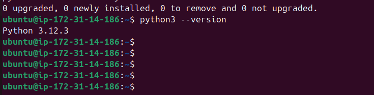
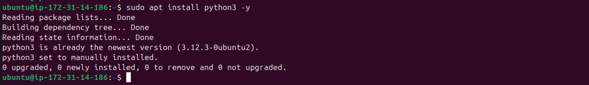
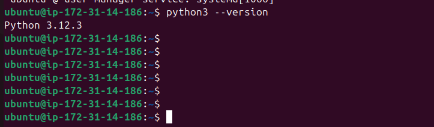
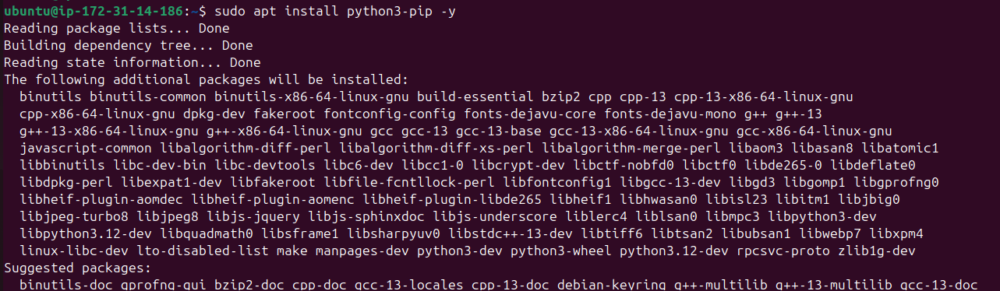

# Python Installation Guide for Linux (Debian/Ubuntu)

> **A comprehensive step-by-step guide for installing Python on Debian/Ubuntu-based Linux systems.**

---

## Table of Contents

1. [Introduction](#introduction)
2. [Scope](#scope)
3. [Prerequisites](#prerequisites)
4. [Procedure](#procedure)
    - [Step 1: Update System Packages](#step-1-update-system-packages)
    - [Step 2: Check Existing Python Installation](#step-2-check-existing-Python-installation)
    - [Step 3: Install Pyhton](#step-3-install-Python)
    - [Step 4: Verify Installation](#step-4-verify-installation)
    - [Step 5: Install pip](#step-5-Install-pip)
    - [Step 6: Verify pip](#step-6-Verify-pip)
5. [Notes](#notes)
6. [Conclusion](#conclusion)
7. [Contact](#contact)
8. [References](#references)

---

## Introduction

This guide provides a clear and concise workflow for installing Python on Debian/Ubuntu-based systems. Python is a widely used programming language and installing it correctly ensures smooth development and execution of Python applications.

---

## Scope

This guide covers:

- Installation of Python step by step.
- Setting up the Python_HOME environment variable.
- Compiling and running a basic Python program for validation.

---

## Prerequisites

- A Debian/Ubuntu-based Linux system
- User privileges to run commands with `sudo`
- Internet connection for downloading packages

---

## Procedure

### Step 1: Update System Packages

```bash
sudo apt update && sudo apt upgrade -y
```

  

---

### Step 2: Check Existing Python Installation

```bash
Python3 -version
```

 
> If Python is installed, you'll see the version details. If not, proceed to the next step.

---

### Step 3: Install Python


```bash
sudo apt install python3 -y
```

---

### Step 4: Verify Installation

```bash
Python3 --version  # Check Python
```

 

---

### Step 5: (Optional) Install pip

#### For Python pip:

```bash
sudo apt install python3-pip -y
```

  

#### Verify pip:

```bash
pip3 --version
```
   

  
  

---


## Notes

- Ensure you install the correct version of Python as per your application requirements.
- Use `sudo` carefully, especially when editing system environment files.


---

## Conclusion

Following this guide will set up Python efficiently on your Debian/Ubuntu system. With Python correctly installed, you are ready to develop and run Python applications seamlessly.

---

## Contact

**Sunny Kumar**  
Email: [sunny.kumar.snaatak@mygurukulam.co](mailto:sunny.kumar.snaatak@mygurukulam.co)

---

## References

| Title        | Link |
|--------------|------|
| Official Python Download Options | [https://discuss.python.org/t/install-python-3-11-9-on-ubuntu/51093](https://discuss.python.org/t/install-python-3-11-9-on-ubuntu/51093) |


---
